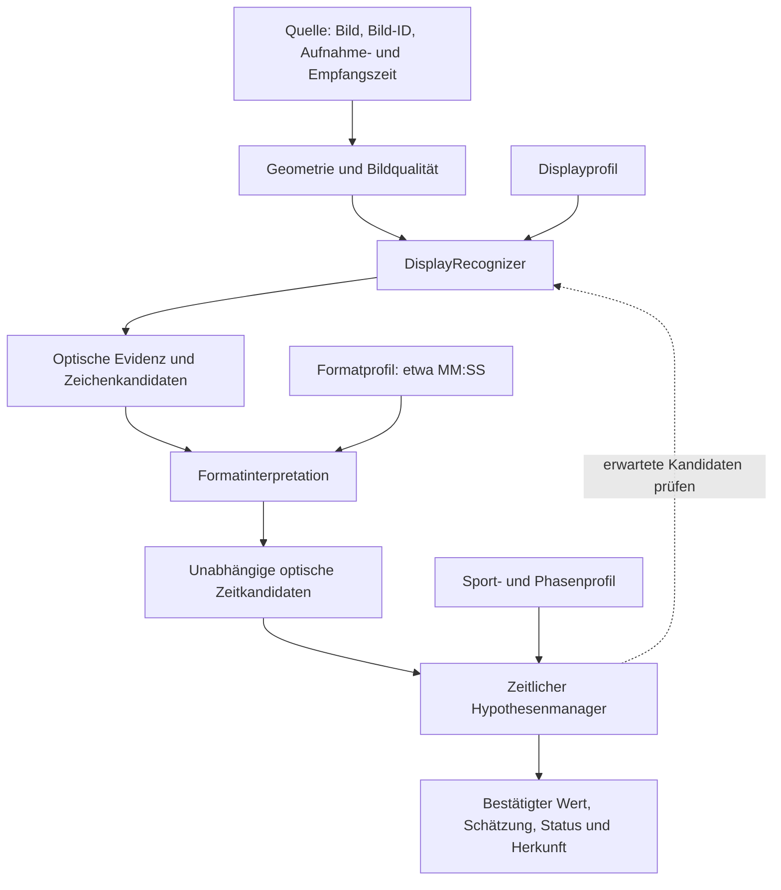

# Architektur- und Plausibilitätsaudit der kamera-basierten Uhrerkennung

**Datum:** 2026-10-04  
**Status:** Ist-Analyse und Architekturvorschlag; keine Freigabe zur Umsetzung  
**Untersuchungsstand:** Lokaler Arbeitsstand einschließlich der zum Auditzeitpunkt vorhandenen, uncommitteten Änderungen.

Der aktuelle Code ist eine brauchbare Grundlage für den Prototypen, aber noch keine durchgängige Architektur für vertrauenswürdige Erkennung. Die wichtigste Schwachstelle ist der frühe Informationsverlust: Aus Bildregionen werden binäre Segmentzustände, daraus einzelne Ziffern und anschließend genau eine Zeit. Der Tracker bekommt die zugrunde liegende optische Unsicherheit nicht mehr.

Recovery ist grundsätzlich vorhanden. Es gibt keine absolute Sperre gegen Rückwärtskorrekturen oder Resets. Allerdings kann die Erkennung praktisch hängen bleiben, wenn korrekte Beobachtungen die vorhandenen Bestätigungsregeln nicht erfüllen.

Code, Konfiguration und Dienste wurden für den Audit nicht verändert. Dieser Bericht wurde anschließend auf ausdrücklichen Wunsch im Repository abgelegt. Die Aussagen beschreiben den untersuchten Code auf dem Datenträger; sie bestätigen nicht, welche Version ein bereits gestarteter Prozess geladen hat. Quellenlinks sind relativ zum Repository und zeigen auf veränderliche Dateien, nicht auf einen festgeschriebenen Commit. Die Zielarchitektur ist ein Vorschlag, keine bereits getroffene Produktentscheidung.

## 1. Aktuelle Architektur

### Tatsächlicher Datenfluss

```text
Videostream / Datei
  ↓
FFmpeg: Bildrate reduzieren, optional zuschneiden
  ↓
BGR-Frame + Empfangszeit
  ↓
Engine.on_frame()
  ↓
SegmentDecoder
  ├─ perspektivische Entzerrung des manuell markierten Uhrbereichs
  ├─ Farbscore pro Pixel
  ├─ räumliche Glättung
  ├─ optionale Nachführung der vier Ziffernfelder
  ├─ Messwert pro Segmentregion
  ├─ binäre Segmententscheidung
  ├─ Mustervergleich pro Ziffer
  └─ Prüfung des Formats MM:SS
  ↓
Reading:
  genau eine Zeichenfolge oder None
  plus diagnostische Segmentwerte
  ↓
Engine übergibt ausschließlich text und confidence
  ↓
ClockTracker
  ├─ Leseserien bilden
  ├─ kurz bestätigte Werte sammeln
  ├─ Fortschreibung / Sprung / Korrektur übernehmen
  ├─ Stillstand erkennen
  └─ bei fehlenden Lesungen gegebenenfalls extrapolieren
  ↓
ClockState
  ↓
JSON / WebSocket / Text / Browser / CSV
```

Belege: [source.py – FFmpegSource.run](../tafeluhr/source.py), [decoder.py – prepare/decode/classify](../tafeluhr/decoder.py), [app.py – Engine.on_frame](../tafeluhr/app.py).

**Korrektur des vorgeschlagenen Modells:** Eine Ebene „einzelne LED-Beobachtungen“ existiert derzeit nicht. Der Decoder findet und verfolgt keine individuellen Lämpchen. Er misst Bildpunkte innerhalb von 28 Rechtecken.

Daneben existieren zwei unterschiedliche Geometrieverfahren:

- **Autofit:** Auf Anforderung relativ aufwendige Suche nach Geometrieparametern anhand mehrerer gespeicherter Frames.
- **Nachführung:** Während der Erkennung begrenztes Verschieben vorhandener Ziffernfelder anhand roter Bildpunkte.

Beide setzen bereits voraus, dass der Uhrbereich und das grundsätzliche Vier-Ziffern-Modell bekannt sind.

## 2. Vorhandene Erkennungsebenen

| Ebene | Implementierung | Datei/Funktion | Input | Output | Score/Confidence |
|---|---|---|---|---|---|
| Bildquelle | FFmpeg, Reconnect, optionale Aufnahme | `source.py / FFmpegSource` | Stream oder Datei | BGR-Frame, Empfangszeit | Verbindungsstatus, kein Bildqualitätsscore |
| Uhrbereich | Perspektivische Transformation | `decoder.py / warp` | Frame, vier Eckpunkte | 672×232 Pixel großes Normbild einschließlich Rand | Kein Geometrievertrauen |
| Farbmerkmale | Rotüberschuss oder Helligkeit | `decoder.py / color_score` | BGR-Pixel | Pixelwerte 0–255 | Farbscore, keine Wahrscheinlichkeit |
| Räumliche Filterung | Gaußfilter 3×3 | `decoder.py / prepare` | Score-Bild | Geglättetes Score-Bild | Kein eigener Qualitätswert |
| Ziffernnachführung | Gewichteter räumlicher Mustervergleich | `alignment.py / update` | Score-Bild, bestehende Felder | Vier Verschiebungen, effektive Segmentfelder | Interne Korrelationswerte und Bestätigungszähler |
| Einzelne LEDs | **Nicht vorhanden** | – | – | – | – |
| Segmentmessung | Mittelwert der stärksten Bildpunkte | `decoder.py / measure` | Segmentrechtecke, Score-Bild | 28 Messwerte | Je Region ein Intensitätswert |
| Segmentzustände | Schwellwertvergleich | `decoder.py / classify` | 28 Messwerte | 28 boolesche Werte | Abstände zum Schwellwert |
| Ziffern | Vergleich mit Segmentmustern | `decoder.py / classify` | Je sieben boolesche Werte | Ziffer oder `None` | Hamming-Distanz, interner Mindestabstand |
| Anzeigeformat | Vier Ziffern, Sekunden-Zehner höchstens 5 | `decoder.py / classify` | Vier Ziffern | `MMSS` oder `None` | Gesamt-Confidence |
| Zeitliche Stabilisierung | Serien, Timer, Sekundenfolgen | `tracker.py / update`, `_consider` | Eine Rohzeit, Zeitstempel, Confidence | Übernommene Zeit, Laufstatus | Timer, aber kein zeitlicher Score |
| Ausgabe | Zustand serialisieren | `app.py / current_state` | Trackerzustand | JSON, Text, WebSocket | Letzte Rohlesungs-Confidence |

### LED- und Segmententscheidung im Detail

Im Rotmodus gilt für jeden Pixel:

```text
excess = R − max(G, B)

Farbscore = excess, wenn:
  excess ≥ 12
  und excess ≥ 0,15 × R

sonst:
  Farbscore = 0
```

Damit werden Weiß, Grau und Grün weitgehend ausgeschlossen. Dies ist ein Kriterium für relativen Rotüberschuss, keine gesonderte Berechnung einer Farbraum-Sättigung.

Im alternativen Helligkeitsmodus gilt:

```text
Score = (3R + 6G + B) / 10
```

Dieser Modus kann helle weiße Bereiche ausdrücklich als starkes Signal behandeln. „Nur rote Lämpchen“ ist deshalb eine Eigenschaft des Rotmodus, keine unveränderliche Systemeigenschaft.

Pro Segmentregion werden anschließend gemittelt:

- Rotmodus: stärkste **5 %** der Bildpunkte.
- Helligkeitsmodus: stärkste **20 %**.
- Mindestens drei Bildpunkte, sofern die Region so viele enthält.

Eine leere Messregion behält den Messwert `0`.

Beleg: [decoder.py – color_score und measure](../tafeluhr/decoder.py).

### Was ergeben die genannten LED-Kombinationen?

Der Code kennt diese Kombinationen nicht als solche:

| Physische Situation | Tatsächliche Behandlung |
|---|---|
| AN AN AN | Häufig hoher Messwert, aber kein explizites „3 von 3“ |
| AN AN AUS | Kann weiterhin klar AN ergeben |
| AN AUS AUS | Kann ebenfalls AN ergeben, wenn die verbleibenden roten Pixel ausreichen |
| AN UNKNOWN UNKNOWN | Nicht von „eine sichtbare rote Lampe, Rest dunkel“ unterscheidbar |
| UNKNOWN UNKNOWN UNKNOWN | Ohne sichtbare rote Pixel Messwert nahe 0 und damit Segment AUS |

**Es gibt weder LED-Mehrheitsentscheidung noch Segment-UNKNOWN.** Ein einzelner LED-Ausfall muss aufgrund der stärksten Bildpunkte nicht zum Ausfall des Segments führen. Das ist aber kein ausdrücklich modelliertes Ausfallverhalten.

## 3. Vorhandene Plausibilitätsprüfungen

### Reihenfolge im laufenden Erkennungspfad

| Reihenfolge | Prüfung | Ebene | hart/weich | Historie | Recovery möglich |
|---|---|---|---|---|---|
| 1 | Uhr-Viereck vorhanden? | Geometrie | Hart | Konfiguration | Nach Kalibrierung |
| 2 | Genügend Rotüberschuss? | Pixel | Hart | Nein | Im nächsten Frame |
| 3 | Nachführung innerhalb Suchbereich und Bildgrenzen | Geometrie | Harte Grenzen, weiche Rangfolge | Verschiebungen und Bestätigungszähler | Nur innerhalb des Suchfensters |
| 4 | Nachführung ausreichend besser und mehrfach bestätigt? | Geometrie | Harte Übernahmeschwellen | Mindestens drei passende Bilder | Ja, begrenzt |
| 5 | Segmentmesswert über Schwellwert? | Segment | Hart | Im Rotmodus keine Signalhistorie | Nächster Frame |
| 6 | Ausreichender Gesamtkontrast und Verhältnis heller/dunkler Gruppe? | Gesamtbild der Segmente | Hart | Nein | Nächster Frame |
| 7 | Segmentmuster zulässig? | Ziffer | Hart mit begrenzter Fehlertoleranz | Nein | Nächster Frame |
| 8 | Alle vier Ziffern bekannt? | Anzeige | Hart | Nein | Nächster Frame |
| 9 | Sekunden-Zehner ≤ 5? | Format | Hart | Nein | Nur mit anderer Lesung |
| 10 | Wiederholte Lesung / kurze Bestätigung? | Zeit | Harte Timerregeln | Ja | Ja |
| 11 | Bisheriger Wert +1? | Zeit | Harte Übernahmeregel | Übernommener Wert | Ja |
| 12 | Zwei bestätigte Werte mit +1 bis +3 und passendem Zeitabstand? | Zeit | Harte Übernahmeregel | Letzte kurz bestätigte Werte | Auch rückwärts zum alten Zustand |
| 13 | Abweichender Wert lange genug konstant? | Zeit | Harte Übernahmeregel | Leseserie | Auch große Sprünge und Resets |
| 14 | Bestätigter Wert lange unverändert? | Laufstatus | Harte Timerregel | Zeit des letzten Wechsels | Wiederanlauf möglich |
| 15 | Keine aktuelle Lesung? | Ausgabe | Bedingte Extrapolation | Zeitanker, letzter bestätigter Wert | Neue passende Lesungen können übernehmen |
| 16 | Alter größer als `coast_ms`? | Ausgabequalität | Statuswechsel | Bestätigungsalter | Ja, aber Fortschreibung wird nicht beendet |

Die Reihenfolge ist wichtig: **Zeitliche Plausibilität kann keine zuvor verworfene Ziffernkombination retten**, weil der Tracker sie nie erhält.

Die konkrete Musterregel akzeptiert einen exakten Treffer oder einen Abstand von genau einem Bit, sofern der Abstand zur zweitbesten anderen Ziffer mindestens drei beträgt. Die Hamming-Distanz gewichtet alle Segmentabweichungen gleich. Für die neue Wertübernahme gelten standardmäßig 150 ms kurze Bestätigung beziehungsweise 1200 ms für einen konstanten abweichenden Wert. Eine laufende Folge darf Schritte von 1 bis 3 haben; der Abstand ihrer Serienanfänge muss zwischen `step − 0,4` und `step + 0,6` Sekunden liegen.

### Separater Plausibilitätspfad im Autofit

Autofit mischt:

- geometrische Grenzen;
- Helligkeit in erwarteten dunklen Zwischenräumen;
- Segmentmuster-Abstände;
- Anzahl gültiger vollständiger Lesungen;
- Decoder-Confidence;
- einen Bonus für aufwärtszählende Zeitfolgen.

Dabei werden benachbarte ausgewertete Bilder mit `0 ≤ Zeitdifferenz ≤ 2` bevorzugt. Tatsächliche Aufnahmezeitabstände werden dem Scorer nicht übergeben. Besonders bei der ausgedünnten Frame-Auswahl ist das nur eine grobe Annahme.

**Damit befindet sich bereits eine Count-up-Annahme im Geometrieoptimierer.** Beleg: [autofit.py – _Scorer](../tafeluhr/autofit.py).

## 4. Confidence-/Score-Modell

Keiner der vorhandenen Werte ist als statistische Wahrscheinlichkeit kalibriert.

| Wert | Berechnung / Bereich | Bedeutung und Verwendung |
|---|---|---|
| Pixel-Farbscore | 0–255; Rotüberschuss mit Schwellen oder gewichtete Helligkeit | Optisches Eingangssignal |
| Segment-`raw` | Mittelwert stärkster Bildpunkte; 0–255 | Signalstärke einer Region, keine Sichtbarkeitsbewertung |
| `on_ref`, `off_ref` | Exponentielle Mittelwerte, `alpha=0,05` | Gelernte Segmentpegel ausschließlich im Helligkeitsmodus |
| `on_n`, `off_n` | Beobachtungszähler | Voraussetzungen für die Pegelnormierung; keine LED-Zuverlässigkeit |
| Normierte Segmentwerte | Im Helligkeitsmodus anhand Referenzen skaliert | Können vor dem späteren Clipping außerhalb 0–255 liegen |
| Otsu-Gruppenmittel `m_off`, `m_on` | Aufteilung der 28 Werte nach maximaler Zwischenklassenvarianz | Geschätzte schwache/starke Signalgruppen |
| `contrast` | `m_on − m_off` | Globaler Abstand beider Gruppen; Abbruch unter `min_contrast`, standardmäßig 20 |
| Verhältnisprüfung | `m_on ≥ 1,6 × max(m_off,1)` | Zusätzliche globale Erkennungsschwelle |
| Segment-`threshold` | Rot: `max(12, 0,15 × m_on)`; Helligkeit: Otsu-Schwelle | Harte AN/AUS-Grenze |
| `values` | `(norm − m_off) / span`, begrenzt auf −0,5 bis 1,5 | Diagnose-/Darstellungswert; keine Wahrscheinlichkeit |
| Hamming-Distanz | 0–7 pro Muster | Anzahl abweichender Segmentbits |
| Zweitbester Abstand | Kleinster Abstand einer anderen Ziffer | Nur zur Entscheidung über Ein-Bit-Toleranz; danach verworfen |
| Segmentmarge | Abstand zur tatsächlichen Schwelle, relativ zu Signalpegel bzw. Schwelle | Grundlage der Confidence |
| Ziffernmarge | Kleinste Segmentmarge; bei toleriertem Ein-Bit-Fehler ×0,4 | Wird nicht als eigene Kandidatenliste ausgegeben |
| `Reading.confidence` | Minimum über die vier Ziffernmargen, auf 0–1 begrenzt, drei Nachkommastellen | Optischer Heuristikwert für genau die gewählte Lesung |
| `ClockState.confidence` | Zuletzt empfangene Confidence einer nichtleeren Rohzeit | Kein Vertrauen in den ausgegebenen Trackerwert; altert nicht automatisch ab |
| Nachführungs-`response` | Gewichtete räumliche Korrelation, durch positive Maskengewichte geteilt | Geometrischer Suchwert; nicht auf 0–1 normiert |
| Nachführungs-`ranked` | `response − 0,005 × (dx²+dy²)` | Bevorzugt kleinere Verschiebungen |
| Nachführungsfreigabe | Mindestens 3,0 und 15 % besser als bisherige Position | Relative Verbesserung, keine absolute Garantie |
| Nachführungs-`supported` | Mindestens zwei Segmentregionen mit jeweils mindestens drei Pixeln >20 | Keine Zählung individueller LEDs |
| Nachführungs-`counts` | Drei ähnliche Kandidaten; Abweichung höchstens zwei Pixel je Achse | Geometrische Stabilisierung |
| Autofit-`score` | Musterbonus, Confidence-Bonus, Dunkelraumstrafe, Zeitfolgenbonus | Gemischtes Optimierungsziel |
| Autofit-`valid_frames` | Anzahl vollständiger syntaktisch gültiger Lesungen | Keine Genauigkeit gegenüber einer Referenz |
| Tracker-Timer | `stable`, `correct`, `stop`, `coast` | Zeitbedingungen, keine Confidence-Scores |
| `last_board_age_ms` | Zeit seit letzter bestätigter Beobachtung | Frische |
| `fps`, `proc_ms` | Durchsatz und Bearbeitungsdauer | Betriebsmetriken, keine Erkennungsqualität |

Die Referenznormierung benötigt pro bekanntem Segment mindestens fünf AN- und fünf AUS-Beobachtungen sowie insgesamt mindestens acht bekannte Segmente. Nur hinreichend große Referenzabstände werden benutzt: Der Abstand muss größer als 30 % des medianen Referenzabstands sein. **Im aktuellen Rotmodus sind Referenznormierung und Lernen deaktiviert.**

Die Segmentmarge ist bei AN `(Wert − Schwelle) / max(m_on − Schwelle, 1)`, bei AUS `(Schwelle − Wert) / max(Schwelle, 1)`. Pro Ziffer wird das Minimum auf 0–1 begrenzt. Bei einer ungültigen Gesamtlesung bleibt die ausgegebene Confidence 0.

Der Autofit-Score besteht konkret aus:

- Musterbonus `sum(max(0, 3 − Distanz)) / 12`;
- bei gültiger Zeit zusätzlich `2 + 2 × confidence`;
- Dunkelraumstrafe mit Faktor 2,5;
- je auswertbarem Zeitpaar +0,8 für Differenzen 0–2, andernfalls −1,5;
- Division der Summe durch die Zahl der ausgewerteten Bilder.

Geometrisch unzulässige Autofit-Kandidaten erhalten `−1e9`. Vertikale Initialschätzung und Schrägenschätzung besitzen weitere interne Suchmerkmale: Zeilenprofil mit 10. Perzentil als Basis, Mindesthub 5 und Grenze bei 35 % des Hubs; die Schrägenschätzung maximiert die Varianz des Spaltenprofils. Diese Werte sind ebenfalls keine Wahrscheinlichkeiten.

Belege: [decoder.py](../tafeluhr/decoder.py), [alignment.py](../tafeluhr/alignment.py), [autofit.py](../tafeluhr/autofit.py).

### Zwei wichtige nachgewiesene Probleme

**1. Confidence beeinflusst keine Trackerentscheidung.**

Eine im Speicher ausgeführte Prüfung übernahm eine wiederholt angebotene Zeit mit `confidence=0.0` als:

```text
time: 18:43
source: board
confidence: 0.0
```

**2. Confidence und ausgegebene Zeit können zu unterschiedlichen Beobachtungen gehören.**

Nach bestätigten `10:00` und einer einzelnen abweichenden Rohlesung `17:00` entstand:

```text
time: 10:00
raw: 17:00
confidence: 0.99
source: predicted
```

Die `0.99` bewertet hier nicht `10:00`. Ursache: `last_conf` wird vor einer möglichen Übernahme aktualisiert. Beleg: [tracker.py – update/state](../tafeluhr/tracker.py).

## 5. Unsicherheitsmodell

### Wo Unsicherheit existiert

- Eine Ziffer kann `None` sein.
- Die gesamte Lesung kann `text=None` sein.
- `Reading.reason` unterscheidet beispielsweise fehlenden Kontrast, unbekannte Ziffern und unzulässige Sekunden-Zehner.
- Segmentmesswerte und Hamming-Distanzen bleiben zunächst im `Reading` verfügbar.
- Der Tracker unterscheidet `none`, `board`, `predicted` und `stale`.

### Wo sie verloren geht

| Übergang | Informationsverlust |
|---|---|
| Bild → Farbscore | Nichtrot wird 0; verdeckt, dunkel, ausgeschaltet und ungeeignet beleuchtet werden nicht getrennt |
| Bildregion → Segmentmesswert | Anzahl, Lage und Identität einzelner LEDs verschwinden |
| Messwert → boolesches Segment | Nähe zur Schwelle wird bei der Musterentscheidung nicht als UNKNOWN behandelt |
| Segmentmuster → Ziffer | Alternative Ziffern werden verworfen |
| Vier Ziffern → Zeit | Keine alternativen Kombinationen |
| `Reading` → Tracker | `digits`, `raw`-Messwerte, Segmentzustände, Distanzen und Fehlergrund werden nicht übergeben |
| Tracker → Textschnittstelle | Herkunft, Alter und Unsicherheit verschwinden vollständig |

**Die harte Segmententscheidung ist der erste entscheidende Verlust für die Kandidatenbildung.** Die nachfolgende Hamming-Auswertung behandelt ein knapp unter der Schwelle liegendes Segment genauso wie ein eindeutig dunkles.

Die drei geforderten Fälle werden deshalb nicht fachlich unterschieden:

- Erwartet AN, beobachtet UNKNOWN: UNKNOWN existiert nicht.
- Erwartet AN, beobachtet AUS: ein abweichendes Bit.
- Erwartet AUS, beobachtet AN: ebenfalls ein abweichendes Bit.

### Vorhandene implizite Zustände

| Variable / Ausgabe | Tatsächliche Bedeutung |
|---|---|
| `last_raw` | Letzte Rohzeit, beim aktuellen nichtlesbaren Frame `None` |
| `recent` | Wiederholte abweichende Werte innerhalb 0,5 Sekunden |
| `run_v`, `run_t0`, `run_last` | Aktuelle bevorzugte Leseserie |
| `short` | Bis zu sechs kurz bestätigte Werte mit Serienbeginn |
| `observed` | Letzter übernommener Wert |
| `anchor_v`, `anchor_t` | Grundlage der Fortschreibung |
| `running` | Zuletzt aus dem Verlauf abgeleiteter Laufstatus |
| `source=none` | Noch kein Wert übernommen |
| `source=board` | Aktuelle Serie entspricht einem frischen übernommenen Wert |
| `source=predicted` | Keine passende aktuelle Bestätigung; kann auch einen gehaltenen Wert bezeichnen |
| `source=stale` | Bestätigter Wert zu alt |

Explizite Zustände `TRUSTED`, `OCCLUDED`, `RECOVERING` oder ein unbekannter Laufstatus fehlen. Insbesondere bedeutet `running=false` beim Start auch „noch nichts bekannt“. Der Browser stellt dies bereits als „steht“ dar.

### Defekte LEDs

Eine dauerhafte Reliability-Bewertung einzelner LEDs ist nicht vorhanden:

- keine LED-Identitäten;
- keine erwarteten Einzel-LED-Zustände;
- keine Defektzähler;
- keine Trennung zwischen Ausfall und Verdeckung.

Die Segmentreferenzen des Helligkeitsmodus sind dafür kein Ersatz. Eine spätere Defekterkennung benötigt stabile LED-Orte und unabhängige, vertrauenswürdige Vergleichszustände. Andernfalls würde das System eigene Fehlentscheidungen als vermeintliche Defekte lernen.

## 6. Zeitmodell

### Count-up ist fest eingebaut

Die normale Fortschreibung arbeitet mit:

```text
neuer Wert = bisheriger Wert + 1
```

Die Recovery über eine laufende Folge verlangt ebenfalls positive Schritte von 1 bis 3. Die Vorhersage addiert vergangene Echtzeit.

Ein kontinuierlicher Countdown mit einem neuen Wert pro Sekunde wurde in der Ablaufprüfung nicht initial übernommen: Die Werte standen nicht lange genug für die 1,2-Sekunden-Regel, und eine abwärtslaufende Folge wird nicht anerkannt.

### Stillstand

Unterstützt, sofern der gleiche bestätigte Wert weiter lesbar bleibt:

- nach standardmäßig 1,6 Sekunden ohne bestätigten Wechsel `running=false`;
- bei sichtbarem bestätigtem Stillstand wird der Wert gehalten.

**Während einer Verdeckung kann das System einen tatsächlichen Stopp nicht feststellen.** Es extrapoliert bei vorherigem `running=true` weiter.

Das widerspricht dem Ziel, Echtzeit nur als Obergrenze zu verwenden: Der aktuelle Code wählt einen konkreten fortgeschriebenen Wert.

### Reset und größere Sprünge

Unterstützt, aber nicht fachlich klassifiziert:

- Ein neuer konstanter Wert kann nach `correct_ms`, standardmäßig 1,2 Sekunden, übernommen werden.
- Eine bestätigte aufwärtslaufende neue Folge kann unabhängig vom alten Wert übernehmen.
- Der Abstand zum alten Wert ist dabei nicht absolut begrenzt.

Ein Reset `20:00 → 00:00` kann somit übernommen werden. Das System erkennt dabei aber nicht „zweite Halbzeit“, sondern lediglich einen neuen akzeptierten Zahlenwert.

### Phasen und Sportregeln

Nicht vorhanden:

- Halbzeit-/Periodenzähler;
- reguläre Phase;
- Sonderphase;
- unbekannte Phase;
- Penalty-/Shootout-Zustand;
- nominale Periodendauer;
- Regel für Spielzeit über dem nominalen Ende.

### Zeitobergrenzen

**`20:00` ist nirgends als harter sportlicher Grenzwert eingebaut.**

Vorhanden sind:

- syntaktisch vier Ziffern;
- Sekunden-Zehner höchstens 5;
- Begrenzung der formatierten Textausgabe auf `99:59`.

Problem: Nur `fmt()` begrenzt den Text. `seconds` kann bei fortgesetzter Vorhersage darüber hinauswachsen.

Reproduziert:

```text
time: 99:59
seconds: 7100
```

### Verdeckung und coast_ms

`coast_ms` beendet die Extrapolation nicht. Es ändert nur `source` auf `stale`.

Reproduziert nach längerer fehlender Sicht:

```text
running: true
source: stale
time: weiter fortgeschrieben
confidence: unverändert
```

Beleg für das Zeitmodell: [tracker.py – _consider/state](../tafeluhr/tracker.py).

### Zeitbasis

Produktiv wird `time.time()` beim Frameempfang verwendet. Es gibt keine separate monotone Zeitbasis für die Trackerintervalle und keine Weitergabe des ursprünglichen Video-Aufnahmezeitpunkts.

Damit können Systemzeitsprünge und wechselnde Streamverzögerung die zeitliche Interpretation beeinflussen.

## 7. Lock-in-Risiko

**Antwort: TEILWEISE.**

**Keine irreversible Sperre:** Eine bereits akzeptierte falsche Zeit verhindert spätere Korrekturen nicht grundsätzlich.

Das wurde im Speicher geprüft:

```text
alter akzeptierter Wert: 18:20
neue Folge:             17:12, 17:13, 17:14
Ergebnis:               17:14, running=true
```

Auch der Reset von einer Folge um `20:00` auf `00:00`, `00:01`, `00:02` wurde übernommen.

**Praktisches Festhängen bleibt möglich**, wenn:

- korrekte Einzelwerte nicht lange genug stabil erkannt werden;
- zwischen brauchbaren Werten mehr als drei Spielsekunden liegen;
- deren Zeitabstände nicht zur vorhandenen Folgenregel passen;
- korrekte und falsche Werte die Leseserien ständig unterbrechen;
- ein Countdown läuft;
- die Optik bereits einen plausiblen, aber falschen Einzelwert liefert.

Die alte Zeit kann dann gehalten oder weitergeschätzt werden. Es gibt keine ausdrückliche Recovery-Phase, in der die Bindung an den alten Zustand mit zunehmender Unsicherheit systematisch gelockert wird.

**Das Problem ist weniger ein absolutes Zeitverbot als ein zu enger und informationsarmer Wiederübernahmepfad.**

## 8. Display-Abstraktion

### Harte Bindungen an die aktuelle Anzeige

- Genau vier Ziffern.
- Genau sieben Segmente pro Ziffer.
- Genau 28 Messregionen.
- Feste Segmentreihenfolge `abcdefg`.
- Festes Musterverzeichnis einschließlich Varianten für 6, 7 und 9.
- Normgeometrie 640×200 mit 16 Pixel Rand.
- Geometrieannahmen über waagerechte und senkrechte Balken.
- Vier unabhängige Nachführungsverschiebungen.
- Kalibrieroberfläche mit sieben benannten Feldern je Ziffer.
- MM:SS-Interpretation unmittelbar im Decoder.

Eine feste Anzahl von drei LEDs pro Segment ist dagegen **nicht** im Decoder kodiert. Einzelne Lampenpositionen existieren nur im synthetischen Videogenerator; dort haben horizontale und vertikale Segmente sogar unterschiedliche Lampenzahlen.

### Bereits brauchbare Abstraktionsgrenzen

- Bildquelle ist weitgehend unabhängig von der Anzeige.
- `SegmentDecoder` und `ClockTracker` sind getrennte Klassen.
- Der Tracker benötigt keine Bilder oder Segmentkoordinaten.
- API und Browser beziehen den Zustand über die Engine.

### Aufwand für einen zweiten Decoder

Für einen einfachen Prototypen könnte ein zweiter Decoder dieselbe Schnittstelle „Text plus Confidence“ liefern. Das wäre relativ überschaubar, würde aber die bestehenden Unsicherheitsverluste übernehmen.

Für das gewünschte Produktziel ist der Aufwand **mittel bis hoch**:

- gemeinsame Recognizer-Schnittstelle definieren;
- Anzeigeformat aus dem Segmentdecoder lösen;
- kandidatenfähige Ergebnisse einführen;
- Geometrie und Kalibrieroberfläche profilspezifisch machen;
- allgemeine Zeitlogik von Count-up-Annahmen befreien.

### Was heute automatisch erkannt wird

Autofit optimiert innerhalb des markierten Bereichs:

- Schräge;
- vertikale Grenzen;
- gemeinsame Ziffernbreite;
- horizontale Ziffernpositionen;
- Lücken;
- Messfelddicke.

Die Nachführung sucht kleine Translationen vorhandener Felder: höchstens ±24 horizontal und ±16 vertikal im Normbild.

Nicht erkannt werden:

- Displaytyp;
- Anzahl der Ziffern;
- Zeitformat;
- Bedeutung anderer numerischer Felder;
- die Uhr als Objekt irgendwo im gesamten Kamerabild.

### Speicherung und UI-Kopplung

Persistiert werden Geometrie, Segmentüberschreibungen, Farbmodus, Nachführungsoption und Trackerzeiten gemeinsam in einer `Config`.

Nicht persistiert werden die laufenden Nachführungsoffsets.

Die UI kennt konkrete Segmentnummern, vier Ziffern und Transformationskonstanten. Sie ist damit stark an dieses Displayprofil gekoppelt. Der allgemeine Kameraausschnitt könnte wiederverwendet werden; der innere Kalibriereditor benötigt eine profilabhängige Beschreibung.

## 9. Sportprofil-Abstraktion

Ein Sportprofil existiert nicht.

Im allgemeinen Code enthaltene fachliche Annahmen:

| Annahme | Ort |
|---|---|
| Uhr läuft normalerweise aufwärts | Tracker |
| Aufwärtsfolgen verbessern eine Geometriebewertung | Autofit |
| Stillstand ist möglich | Tracker |
| Sprünge und Resets sind möglich | Tracker |
| Einheitsschritte entsprechen Sekunden | Tracker |
| Ausgabe ist eine Uhr in MM:SS | Decoder, Tracker, UI und API |

Die Sekundenformatprüfung ist keine Sportregel, liegt aber derzeit gemeinsam mit der optischen Ziffernerkennung.

**Es gibt keine produktive Regel „zweite Halbzeit beginnt bei 45:00“.** Diese Annahme findet sich jedoch im Testgenerator und in einem Testszenario. Sie entspricht nicht dem beschriebenen Ablauf mit zwei aufwärtszählenden Perioden ab `00:00`.

Belege: [gen_testvideo.py – TIMELINE](../tools/gen_testvideo.py), [test_tracker.py – Halbzeitszenario](../tools/test_tracker.py).

## 10. Ist gegen Zielbild

| Funktion | vorhanden | teilweise | fehlt | Empfehlung |
|---|:---:|:---:|:---:|---|
| Austauschbare Videoquelle | ✓ | | | Erhalten |
| Perspektivische Uhr-ROI | ✓ | | | Erhalten, Qualität ergänzen |
| Automatische Zifferngeometrie | | ✓ | | Autofit und Nachführung klar unterscheiden |
| Displaytyp automatisch erkennen | | | ✓ | Optionaler Detektor mit explizitem Fallback |
| Explizite Displayprofile | | | ✓ | Einführung vor zweitem Recognizer |
| Einzel-LED-Evidenz | | | ✓ | Optional innerhalb geeigneter Displayprofile |
| Segmentmesswerte | ✓ | | | Als Evidenz weiterreichen |
| Segment-UNKNOWN | | | ✓ | Sichtbarkeit von Leuchtzustand trennen |
| Ziffernkandidaten | | | ✓ | Mehrere Kandidaten und Widersprüche erhalten |
| Formatprüfung | | ✓ | | In eigenen Formatbaustein lösen |
| Sport-/Phasenprofil | | | ✓ | Unabhängig vom Display ergänzen |
| Zeitliche Stabilisierung | ✓ | | | Verhalten sichern, anschließend auf Evidenz umstellen |
| Rückwärtskorrektur | | ✓ | | Bestehenden Weg erhalten und systematisieren |
| Explizite Recovery-Hypothese | | | ✓ | Parallel zur Primary-Hypothese führen |
| Sichtbarkeitsmodell | | | ✓ | Früh bestimmen, bis zur Ausgabe mitführen |
| Direkter Vergleich erwarteter Gesamtmuster | | | ✓ | Recognizer-seitige Kandidatenbewertung |
| Vertrauenswürdige Ausgabe mit Herkunft | | ✓ | | Beobachtung, Schätzung und gehaltenen Wert trennen |
| Defektbewertung einzelner LEDs | | | ✓ | Erst nach zuverlässiger LED-Zuordnung |
| Reale Genauigkeitsmessung | | ✓ | | Referenzannotationen und Replay-Korpus ausbauen |

### Abweichungen zwischen Dokumentation und Code

| Behauptung | Tatsächliches Verhalten |
|---|---|
| Vorhersage höchstens bis `coast_ms` | Danach nur `stale`; Fortschreibung bleibt möglich |
| „Alter Wert +1 sofort übernommen“ | Erst nach kurzer Bestätigung |
| „Bei Stopp läuft die Anzeige nie vor“ | Nur bei ausreichend sichtbarer Tafel; bei verdecktem Stopp wird weitergeschätzt |
| `predicted` bedeutet Weiterzählen | Kann auch ein unverändert gehaltener Wert sein |
| Referenzlernen und Otsu bestimmen die Segmentzustände generell | Im Rotmodus kein Referenzlernen; Otsu liefert Gruppenwerte, die Entscheidung nutzt eine andere Schwelle |
| Browser-Debug grün/rot | Der aktuelle Editor zeigt bewegliche Messfelder über einem rahmenlosen Bild |
| Historische Trefferquoten aus README | Kein aktueller Nachweis für den veränderten Code und die reale Kamera |

Die berichteten etwa 80 % Stabilität sind ein wertvoller Betriebsbefund, aber noch keine definierte Genauigkeitskennzahl. Auch `eval_live` zählt lediglich vollständige Lesungen, unabhängig davon, ob sie richtig sind.

## 11. Kritische Schwachstellen

Die Einstufung bezieht sich auf das Ziel einer verlässlich weiterverwendbaren Spielzeit.

### CRITICAL

**Unbeobachtete Fortschreibung hat keine wirksame Ablaufgrenze.**

Bei fehlender Sicht kann eine laufende Uhr unbegrenzt weitergeschätzt werden. Der Textendpunkt entfernt zusätzlich den `stale`-Hinweis. Nachgelagerte Verbraucher können damit eine nicht mehr belegte Zeit als aktuelle Spielzeit darstellen.

### HIGH

1. **UNKNOWN wird auf Segmentebene zu AUS.** Verdeckung kann dadurch ein anderes gültiges Ziffernmuster erzeugen.
2. **Confidence ist keine Übernahmebedingung und nicht eindeutig an die ausgegebene Zeit gebunden.**
3. **Alternative Ziffern und Zeiten gehen vor der zeitlichen Bewertung verloren.**
4. **Keine ausdrückliche Primary-/Recovery- und Sichtbarkeitslogik.**
5. **Nachführung besitzt keinen ausgegebenen Geometriequalitätsstatus.** Auch falsche, aber rote Bildstrukturen können ihre Bewertung beeinflussen.
6. **Autofit übernimmt bereits bei mindestens einem gültigen Frame.** Ein Vergleich mit der bisherigen Kalibrierung, eine Mindestquote oder ein unabhängiger Genauigkeitsnachweis fehlen.
7. **Count-up ist sowohl im Tracker als auch in Autofit eingebaut.**

### MEDIUM

- `time` und `seconds` können bei Werten über `99:59` auseinanderlaufen.
- Wandzeit statt monotoner Intervallzeit; keine ausdrückliche Erfassung der Bildfrische.
- Blockierendes FFmpeg-Lesen ohne eigenen Frame-Watchdog. `source_connected=true` beweist kein aktuelles Bild.
- API-Schema enthält keine explizite Sichtbarkeit und keinen unbekannten Laufstatus.
- Konfiguration validiert Segmentüberschreibungen, andere Geometrie- und Zeitparameter aber nur unzureichend.
- Kalibrierung, optische Parameter und Zeitregeln befinden sich in derselben Konfiguration.
- Autofit bewertet zeitliche Abstände ohne die tatsächlichen Framezeitstempel.
- Frame, Geometrie und Reading sind für Diagnoseausgaben nicht durchgängig als ein versionierter Beobachtungssatz gebunden.

### LOW

- Veraltete Kommentare und teilweise veraltete Bedienhinweise.
- Historische Benchmarkwerte ohne Bindung an Codeversion und Testmaterial.
- Nicht festgelegte Dependency-Versionen erschweren reproduzierbare Vergleiche.
- Mehrere wichtige Zwischenscores existieren nur lokal und sind im Diagnoseprotokoll nicht verfügbar.

## 12. Empfohlene Zielarchitektur

**Die vorhandene Trennung zwischen Quelle, Decoder, Tracker und Ausgabe sollte erhalten bleiben.** Benötigt werden vor allem bessere Verträge zwischen diesen Bereichen.



### Komponenten und Verantwortlichkeiten

| Komponente | Verantwortung |
|---|---|
| `FrameSource` | Bild-ID, Aufnahme-/Empfangszeit, Frische, Verbindung |
| Geometriebaustein | ROI, Transformation, Nachführung, Geometriequalität |
| `DisplayRecognizer` | Displayabhängige optische Interpretation und Kandidatenbewertung |
| `DisplayProfile` | Physischer Anzeigetyp, Geometrie, Farben, zulässige Glyphenvarianten |
| `FormatProfile` | Zeichen in Werte übersetzen; beispielsweise MM:SS und Sekundenregeln |
| `ClockPolicy` | Richtung, Stopp-/Resetmöglichkeiten, fachliche Übergänge |
| `PhaseContext` | Regulär, Sonderphase oder unbekannt; gegebenenfalls Periodeninformation |
| Hypothesenmanager | Primary, unabhängige Recovery, zeitliche Stabilisierung |
| Ausgabeadapter | Bestätigten Wert, Schätzung, Status, Alter und Gründe klar ausgeben |
| Diagnose/Replay | Evidenz und Entscheidungen reproduzierbar untersuchen |

Ein Punktmatrix-Recognizer muss intern keine Segmente erzeugen. Die gemeinsame Schnittstelle sollte deshalb **Kandidaten und Evidenz** beschreiben, nicht zwingend sieben Segmente.

### Displaytyp auto

Als optionale Auswahlstufe sinnvoll:

- explizit konfigurierte Typen bleiben immer möglich;
- Auto-Erkennung kann mehrere Profilhypothesen prüfen;
- sie darf „nicht eindeutig“ liefern;
- ein Typwechsel benötigt eigene Bestätigung;
- die Sportlogik darf nicht zur versteckten Voraussetzung für die Auswahl eines Displaytyps werden.

### Evidenz statt früher Endentscheidung

Für sieben Segmente sollten mindestens getrennt vorliegen:

```text
Leuchtevidenz
Sichtbarkeit / Beurteilbarkeit
Widerspruch zu einer Hypothese
Geometriequalität
```

`ON`, `OFF`, `UNKNOWN` wären daraus abgeleitete Zustände, nicht die einzige gespeicherte Information.

Eine unbekannte Region darf schwach gegen eine Ziffer sprechen; eine sichtbar widersprechende Region deutlich stärker.

### Primary und Recovery

**PRIMARY** bewertet Kandidaten im Zusammenhang mit bisheriger vertrauenswürdiger Beobachtung, Echtzeit, Richtung und Phase.

Für eine vorwärtszählende, anhaltbare Uhr:

```text
letzte sichere Zeit = 18:37
vergangene Echtzeit = 5 Sekunden

normal erreichbarer Bereich ungefähr:
18:37 bis 18:42
```

Diese Menge ist ein Plausibilitätsbereich, kein Zwang zur Fortschreibung.

**RECOVERY** muss parallel aus der aktuellen Optik entstehen, ohne auf diesen Bereich beschränkt zu sein. Wiederholt gute Beobachtungen außerhalb des Primary-Bereichs müssen einen Wechsel auslösen können.

Reset, Korrektur und Wiederauftauchen nach Verdeckung sind mögliche Erklärungen eines Wechsels. Ohne zusätzliche Information muss das System die genaue Ursache nicht sicher behaupten.

### Direkter Vergleich erwarteter Segmentmuster

Das ist für den vorhandenen Decoder sinnvoll, heute aber nicht umgesetzt.

Bereits vorhanden:

- Segmentmesswerte;
- Musterdefinitionen der Ziffern;
- letzte übernommene Zeit.

Es fehlen:

- kandidatengesteuerte Bewertung der vollständigen Anzeige;
- UNKNOWN-/Visibility-Gewichtung;
- parallele unbeschränkte optische Recovery.

Der Hypothesenmanager könnte `14:30` und `14:31` vorschlagen. Der Recognizer bewertet beide gegen dieselbe beobachtete Segmentmatrix. **Er darf daneben weiterhin andere optisch gute Kandidaten liefern**, sonst entsteht gerade die befürchtete Selbstbestätigung.

### Sport- und Custom-Profil

Das beschriebene Blindfußballverhalten sollte als konkrete fachliche Konfiguration behandelt werden:

- aufwärts;
- stoppbar;
- reguläre Perioden nominell 20 Minuten;
- Rücksetzen auf `00:00` zwischen Perioden möglich;
- Verhalten in Sonderphasen noch unbekannt.

Die nominale Dauer ist zunächst ein Plausibilitätshinweis, kein optischer Ausschlussfilter.

Ein neutrales `custom`-Profil sollte Richtung einschließlich `unknown`, Stopp, Reset, Zahlenüberlauf und optionale nominale Grenzen beschreiben können. Bei unbekannten Regeln ist Zurückhaltung besser als eine erfundene harte Grenze.

### Ausgabe

Mindestens logisch trennen:

- aktuelle optische Beobachtung;
- letzter vertrauenswürdig bestätigter Wert;
- optionale Schätzung;
- Laufstatus einschließlich unbekannt;
- Sichtbarkeit;
- Alter;
- Recovery-/Phasenstatus;
- optischen und zeitlichen Bewertungsanteil.

Ein einziger frei interpretierbarer `confidence`-Wert reicht dafür nicht.

## 13. Empfohlene Umsetzungsetappen

| Etappe | Inhalt | Prüfkriterium |
|---|---|---|
| 1 | Aktuelles Verhalten mit Replaymaterial und Regressionstests absichern | Fehler und erfolgreiche Fälle reproduzierbar |
| 2 | Ausgabesemantik klären: Beobachtung, bestätigter Wert, Schätzung, Alter | Keine scheinbar sichere Ausgabe ohne passende Evidenz |
| 3 | Zeitbasis und Ablauf der Vorhersage korrigieren | Verdeckung, Streamstopp und Zeitsprünge beherrscht |
| 4 | Formatinterpretation und Konfigurationsbereiche trennen | MM:SS bleibt unverändert, Sportregeln liegen nicht im Decoder |
| 5 | Segment-Evidenz und UNKNOWN einführen | Verdeckung unterscheidbar von sicher AUS |
| 6 | Mehrere Ziffern-/Zeitkandidaten erhalten | Mehrdeutigkeit bleibt bis zur zeitlichen Entscheidung verfügbar |
| 7 | Primary/Recovery mit explizitem Wiederübernahmeverhalten | Falscher bestätigter Zustand kann zuverlässig verlassen werden |
| 8 | Fachliche Clock-/Phasenprofile einführen | Count-up, Count-down, Reset und unbekannte Phase getrennt testbar |
| 9 | Erwartete Gesamtmuster gegen Segment-Evidenz bewerten | Robustheitsgewinn ohne Selbstbestätigung |
| 10 | Zweiten Display-Recognizer ergänzen | Keine Änderung der allgemeinen Zeitlogik erforderlich |
| 11 | Optional Typ-Autoerkennung und LED-Reliability | Unsicherheit und Fallback bleiben ausdrücklich möglich |

Keine komplette Neustrukturierung auf einmal. Gerade das bestehende funktionierende Rotverfahren sollte zunächst als ein Recognizer erhalten bleiben.

## 14. Tests und Testlücken

### Vorhandene Tests

| Datei | Abdeckung | Wesentliche Grenze |
|---|---|---|
| [test_tracker.py](../tools/test_tracker.py) | Laufende Uhr, vier Sekunden Verdeckung, Stopp, Sprung, Ausreißer, Reset | Idealisierte bereits erkannte Zeitwerte |
| [test_red_tracking.py](../tools/test_red_tracking.py) | Farben, Ziffern, Helligkeit, einfache Netzüberlagerung, Rückwärtskorrektur, Pause/Wiederanlauf | Optiktests verwenden gefüllte Segmentregionen, keine gezielte Einzel-LED-Ausfallmatrix |
| [test_alignment.py](../tools/test_alignment.py) | Verschiebung, Mehrbildbestätigung, Begrenzung, schwarzes Bild, Überlappung | Keine komplexe rote Verdeckung oder konkurrierende Anzeige |
| [test_segments.py](../tools/test_segments.py) | Kalibrierung, Speicherung, Grenzen, API-Felder, Debug-Hintergrund | Keine semantische Erkennungssicherheit |
| [test_segment_ui.cjs](../tools/test_segment_ui.cjs) | Ziehen, Größenänderung, Projektion, verspätete Bilder | Simulierte Browserumgebung |
| [gen_testvideo.py](../tools/gen_testvideo.py) | Einzelne gezeichnete LEDs, Netz, Rauschen, Verdeckung, Zeitabläufe | Spezifische Tafel und teilweise unpassender Halbzeitablauf |
| [eval_offline.py](../tools/eval_offline.py) | Vergleich mit Referenzzeit, Rohfehler, Ausgabefehler, Laufstatus | Keine Confidence-Kalibrierung oder umfassende Recovery-Metrik |
| [eval_live.py](../tools/eval_live.py) | Frische Kamerabilder mit lokaler Decoderfassung prüfen | Lesbarkeit statt Genauigkeit; keine Ground Truth |

Für diesen Audit wurden die sieben Rot-/Tracking-Tests, drei Nachführungstests, neun Szenarioprüfungen des Tracker-Skripts und die JavaScript-Prüfungen erneut erfolgreich ausgeführt. Zusätzliche Ablaufprüfungen erfolgten ausschließlich im Speicher.

### Vor späteren Änderungen ergänzen

**LED und Segment**

- Drei, zwei und eine sichtbare aktive LED bei unterschiedlichen Helligkeiten.
- Reproduzierbar defekte LED gegenüber vorübergehender Verdeckung.
- Weißer Reflex, roter Reflex und rote Personenkleidung.
- Sicher AUS gegenüber UNKNOWN.
- Teilweise und vollständige Verdeckung bei ansonsten gültigen Ziffern.
- Unterschiedliche Regionengrößen und unterschiedliche Anzahlen sichtbarer Pixel.

**Ziffern und Format**

- Alle 128 binären Segmentmuster.
- Mehrdeutige Kandidaten und alternative Glyphen.
- Gezielt 5/9, 0/8, 1/7.
- Ein unbekanntes gegenüber einem sicher widersprechenden Segment.
- `88:88` als syntaktisch ungültige Zeit.
- Werte über `20:00` als weiterhin zulässige MM:SS-Werte.
- Konsistenz von Text und numerischem Wert an `99:59`.

**Zeit und Recovery**

- Der konkrete Ablauf `19:58 → 19:59 → 20:00 → 00:00 → 00:01`.
- Falsch akzeptierte Zeit mit anschließender korrekter laufender Folge.
- Rückwärtskorrektur mit unregelmäßigen Leselücken.
- `12:43`, zwanzig Sekunden verdeckt, danach `12:51`, `12:52`, `12:53`.
- Stopp während Verdeckung und anschließender Wiederanlauf.
- Sichtbare Bedienkorrektur in beide Richtungen.
- Count-down sowie unbekannte Richtung.
- Überschreiten von `coast_ms`.
- Niedrige optische Confidence trotz zeitlich sauberer Folge.
- Confidence einer abweichenden Rohlesung darf nicht den alten Ausgabewert bewerten.

**Geometrie, Quelle und Integration**

- Keine Nachführung auf eine vorbeilaufende rote Person.
- Wechsel zwischen manuellem und automatischem Betrieb.
- Kameraverschiebung außerhalb des Suchfensters.
- Autofit darf eine gute Kalibrierung nicht aufgrund einer zufälligen gültigen Lesung verschlechtern.
- Stehender Stream, wiederholte Frames und wechselnde Latenz.
- Wandzeitsprung bei unverändertem Videoverlauf.
- Qualitätsverlust darf nicht als bestätigter Spielstopp erscheinen.

Für belastbare Aussagen über die etwa 80 % sollten künftig getrennt gemessen werden: **Lesbarkeit, Zifferngenauigkeit, falsche Übernahmen, Verfügbarkeit bestätigter Werte, Stoppverzögerung und Recovery-Dauer.**

## Abschließende Antworten A–I

| Frage | Antwort |
|---|---|
| **A – Wird Unsicherheit durchgereicht?** | **Nur teilweise.** Messwerte bleiben kurzzeitig erhalten, aber Segmentzustände sind binär und alternative Ziffern werden verworfen. Der Tracker bekommt keine Segment-Evidenz. |
| **B – Sind optische Sicherheit und zeitliche Plausibilität getrennt?** | **Implementatorisch teilweise, semantisch unzureichend.** Der optische Score entsteht im Decoder; der Tracker benutzt ihn nicht zur Entscheidung. Autofit mischt optische und zeitliche Kriterien. |
| **C – Kann sich das System aus einer falschen bestätigten Zeit erholen?** | **Ja, unter Bedingungen.** Konstante neue Werte oder passende aufwärtslaufende Folgen können übernehmen, auch rückwärts zum alten Wert. Eine allgemeine Recovery-Strategie fehlt. |
| **D – Count-up oder Count-down?** | **Count-up ist fest eingebaut.** Ein normal laufender Countdown wird nicht gleichwertig unterstützt. |
| **E – Kann ein legitimer Periodenreset erkannt werden?** | **Als neuer Zahlenwert ja; als fachlicher Periodenwechsel nein.** |
| **F – Ist 20:00 eine harte Grenze?** | **Nein.** Die `1200` im Tracker bezeichnet Millisekunden Bestätigungszeit. Eine andere Grenze ist die Textformatierung auf `99:59`. |
| **G – Sind Sportregeln und Displayerkennung getrennt?** | **Nicht ausreichend.** Decoder und Tracker sind getrennt, aber Formatregeln liegen im Decoder, Count-up-Annahmen auch im Autofit; Sportprofile fehlen. |
| **H – Aufwand für zweiten Displaydecoder?** | **Für einen einfachen Textlieferanten überschaubar; für die geforderte Qualität mittel bis hoch.** Kandidatenvertrag, Format, Geometrie und UI müssen vorher entkoppelt werden. |
| **I – Was erhalten, was trennen?** | **Erhalten:** Quelle, eigenständiger Decoder, Tracker, APIs, Replaymöglichkeiten und manuelle Kalibrierung. **Trennen:** Displayphysik, Anzeigeformat, Sport-/Phasenregeln, optische Evidenz, zeitliche Hypothesen und Ausgabevertrauen. |
